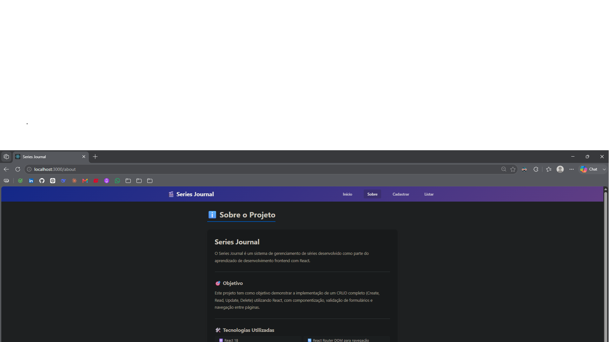
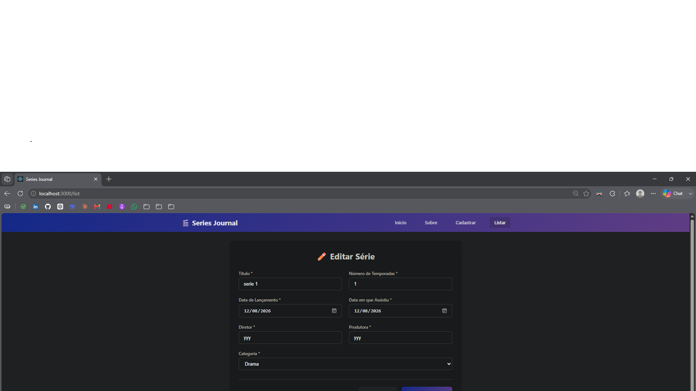
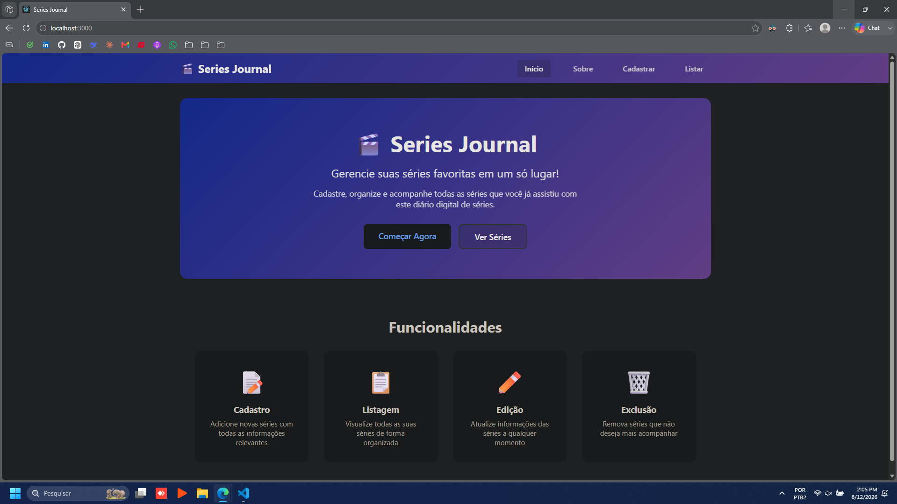
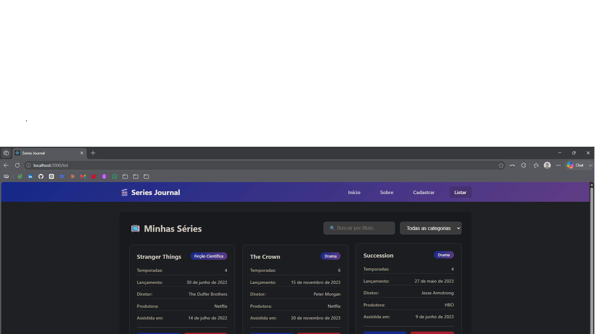
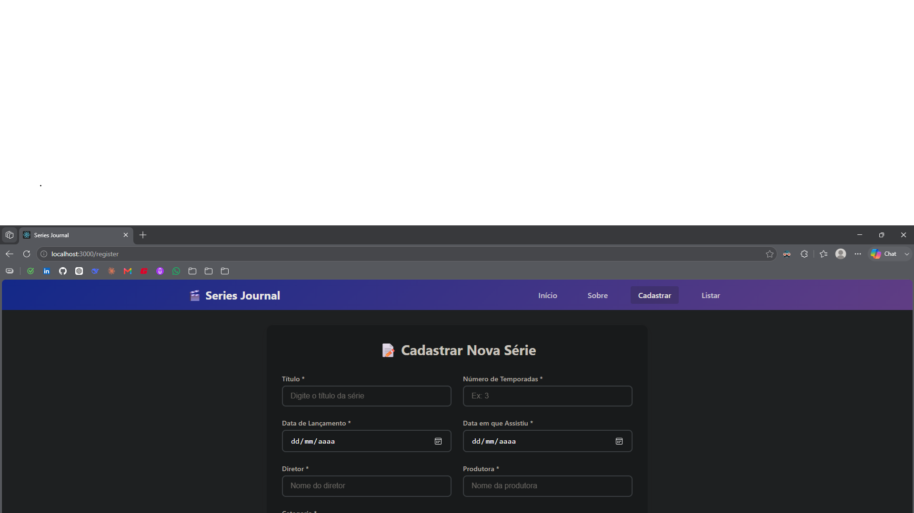
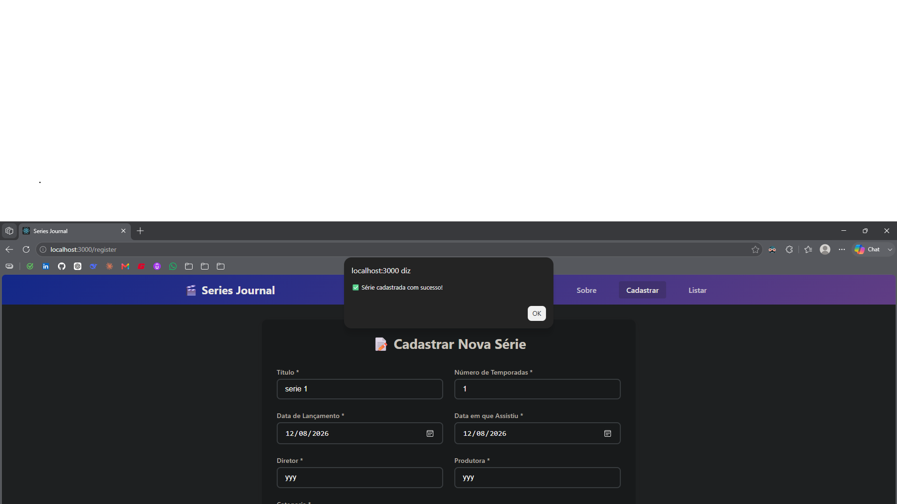

# 🎬 Series Journal - Fase 1

## 📝 Descrição do Projeto

O **Series Journal** é um sistema de gerenciamento de séries desenvolvido como parte da disciplina de Desenvolvimento de Sistemas Frontend. O projeto consiste em um CRUD (Create, Read, Update, Delete) para um diário de séries assistidas, implementado com React.

## 📁 Estrutura do projeto

src/
<br>
├── components/
<br>
│   ├── NavBar/
<br>
│   │   ├── NavBar.jsx    
<br>
│   │   └── NavBar.css
<br>
│   ├── SerieForm/
<br>
│   │   ├── SerieForm.jsx  
<br>
│   │   └── SerieForm.css
<br>
│   └── SerieList/
<br>
│       ├── SerieList.jsx
<br>
│       └── SerieList.css
<br>
├── pages/
<br>
│   ├── Home.jsx
<br>
│   ├── About.jsx 
<br>
│   ├── Register.jsx        
<br>
│   └── List.jsx  
<br>
├── App.jsx
<br>
├── App.css
<br>
├── index.js
<br>
└── index.css

## 📸 Capturas de tela

 
 
 
 
 



## 🚀 Como Executar o Projeto

### Pré-requisitos
- Node.js (versão 14 ou superior)
- npm (gerenciador de pacotes)

### Instalação e Execução

```bash
# 1. Clone o repositório ou extraia os arquivos
# 2. Instale as dependências
npm install

# 3. Execute o projeto
npm start
